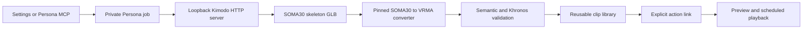

# Kimodo animation generation integration

Status: experimental loopback HTTP integration implemented

Compatibility research was performed against
[`localai-org/kimodo.cpp@f782a72`](https://github.com/localai-org/kimodo.cpp/commit/f782a7236706749d1ffeabeed140eb14032d19f3)
on 2026-08-30. Kimodo does not publish a stable server protocol or tagged
release at that revision, so maintainers must repeat the compatibility checks
in [the maintenance runbook](KIMODO_MAINTENANCE.md) before changing the pinned
baseline.

## Product boundary

Kimodo is an optional, separately installed text-to-motion provider. Persona
does not download Kimodo, install model weights, discover an executable, start
or stop a process, or alter its behavior by operating system. The only runtime
contract is a compatible HTTP server already listening on a literal loopback
address. The default is `http://127.0.0.1:8090`.

Persona owns:

- provider configuration and compatibility checks;
- bounded asynchronous jobs and local recovery;
- conversion from the supported SOMA30 source dialect to VRMA;
- semantic and Khronos glTF validation;
- the reusable clip library and action-to-clip links;
- Settings and Persona MCP surfaces.

Kimodo owns inference, its model files, and its provider-side job history.
Disabling or removing Kimodo does not affect existing Persona clips, actions,
voice listening, or normal MCP playback.



Kimodo does not produce a VRM Animation file at the pinned revision. Its GLB
is source material only. Persona never renames a generic `.glb` to `.vrma` and
never publishes a clip before conversion and both validation gates succeed.
Generation creates an unlinked reusable clip; it never creates an action
implicitly.

## Implemented components

| Concern | Source |
| --- | --- |
| Configuration, jobs, polling, recovery and installation | [`electron/animation-generator.cts`](../electron/animation-generator.cts) |
| Exact SOMA30 parser, retargeting and VRMA writer | [`electron/kimodo-vrma.cts`](../electron/kimodo-vrma.cts) |
| Khronos core glTF validation | [`electron/gltf-validation.cts`](../electron/gltf-validation.cts) |
| Reusable clip and action-link persistence | [`electron/settings-store.cts`](../electron/settings-store.cts) |
| Sender-gated IPC and sandboxed bridge | [`electron/main.cts`](../electron/main.cts), [`electron/preload.cts`](../electron/preload.cts) |
| Kimodo Settings UI | [`src/components/settings/KimodoSection.tsx`](../src/components/settings/KimodoSection.tsx) |
| Agent generation and progress tools | [`electron/mcp-server.cts`](../electron/mcp-server.cts) |

## Provider contract

Persona supports this HTTP surface:

| Request | Use |
| --- | --- |
| `GET /api/models` | Validate the exact supported model descriptor |
| `POST /api/generate` | Submit one bounded request and receive a provider job ID |
| `GET /api/animations` | Poll the matching provider job |
| `GET /api/animations/{id}/animation.glb` | Download the completed SOMA30 source |

Only `soma-rp-v1.1` with the expected `soma30` hierarchy, parents, offsets and
license descriptor is accepted. Requests allow:

- one prompt from 1 to 4096 UTF-8 bytes;
- 60–150 frames;
- 1–1000 diffusion steps;
- a nonnegative JavaScript safe-integer seed;
- one active Persona generation at a time.

The Settings defaults are 150 frames, 50 steps and seed zero. Persona requires
plain HTTP on literal `127.0.0.1` or `::1`, rejects credentials, paths, query
strings, fragments and redirects, limits JSON to 1 MiB, limits source output
to 64 MiB, and applies request and four-hour generation deadlines.

Connection status has three meanings:

- `disabled`: local generation is off;
- `unavailable`: the endpoint cannot be reached or is incompatible;
- `ready`: the endpoint advertises the exact supported model as available.

`ready` proves API compatibility only. A completed normal generation is the
end-to-end inference and conversion check.

## Durable job lifecycle

Provider configuration and the newest 100 job records live in
`userData/animation-generator.json`. The file is written through a private
mode-`0600` temporary file, flushed, and atomically renamed. It is separate
from the renderer-visible Persona settings snapshot.

Before a new job is recorded or submitted, Persona checks:

- that the reusable library has room for another clip;
- that no other generation is active;
- that enough free storage exists for the bounded source, converted output and
  transactional overhead.

The normal phases are:

```text
queued -> submitting -> generating -> downloading -> converting
       -> installing -> ready
```

Polling starts near 2.5 seconds, uses bounded jitter and exponential backoff,
and stops growing at 15 seconds. A provider job missing from five consecutive
animation-list responses is treated as incompatible rather than polled
forever.

The source response is streamed to
`userData/animation-generation/<job-id>/source.glb.tmp`, bounded while it is
read, flushed, hashed and renamed to `source.glb`. A validated converted output
is similarly written as `animation.vrma.tmp` and renamed to `animation.vrma`.
These paths are private implementation details and are never sent to the
renderer or MCP.

### Failure and retry

A failed or interrupted job records a stable error code, a safe user-facing
message, the failed stage and an attempt count. Raw provider response bodies,
converter diagnostics, command output and filesystem paths are not persisted
in the public job record or returned through MCP.

Persona retains the furthest safe local artifact after a failure:

| Last safe artifact | Retry behavior |
| --- | --- |
| Validated output already installed | Reconcile the existing library clip; never duplicate it |
| Retained `animation.vrma` | Revalidate and retry library installation |
| Retained `source.glb` | Re-run conversion and installation without another inference |
| Known provider job ID | Resume polling or download without another submission |
| No safe artifact or provider ID | Submit the saved request again after an explicit Retry |

If Kimodo explicitly reported a provider job failure, Retry starts a new
provider submission. Other interrupted provider jobs retain their ID so a
restart does not silently create duplicate inference work. Active records are
marked `interrupted` when Persona starts again and can be resumed explicitly.
Changing the configured endpoint or model clears remote provider IDs from
recoverable jobs, while retaining any verified local source or VRMA artifact;
Persona never applies an old remote ID to a different server.

The per-job recovery directory is removed only after the clip is reconciled as
ready, when that job is discarded, when all recent jobs are cleared, or when
the bounded history evicts it. Startup also removes exact UUID-named recovery
directories that no retained job owns, so an interrupted cleanup cannot leak
storage indefinitely. Clearing or discarding job history never deletes an
installed reusable clip and cannot remove Kimodo's provider-side copy.

Cancellation of a running provider job is not implemented because the pinned
HTTP API has no cancellation endpoint. Closing Persona interrupts local work;
it does not claim to stop inference in Kimodo.

## VRMA conversion boundary

The converter is intentionally not a general GLB-to-VRMA utility. It accepts
only the pinned SOMA30 dialect and verifies the complete hierarchy, parent
indices, rest offsets, animation channel count, accessors, finite values,
quaternion norms, frame range and 30 fps timeline.

Conversion then:

- maps SOMA joints to VRM humanoid bones;
- composes the two source neck joints into VRM's single neck;
- preserves the optional jaw track;
- normalizes and sign-canonicalizes quaternions;
- grounds hips translation against the source rest pose;
- emits `VRMC_vrm_animation` 1.0 metadata and a self-contained GLB.

The output must pass Persona's exact semantic validator and the pinned Khronos
glTF Validator with zero errors or warnings. Loader tests exercise the same
`VRMAnimationLoaderPlugin` used by production and opt-in tests can retarget a
real Kimodo source against both VRM 0.x and VRM 1.0 models.

Passing these gates proves structural compatibility, not motion quality.
Release qualification still requires visual checks for facing, feet, contacts,
root drift, proportions and transitions.

## Clip and action workflow

The **Kimodo** Settings tab contains:

- cards for generated clips with Preview, New action, Download and Delete;
- a prompt-first generation dialog with optional clip title, frames, steps and
  seed;
- recent job status with Retry, per-job Discard and Clear recent jobs;
- endpoint, model, local-generation and MCP opt-in controls;
- a GitHub button linking to
  [`localai-org/kimodo.cpp`](https://github.com/localai-org/kimodo.cpp).

All imported and generated VRMA files belong to one reusable library. The
**Animations** tab's **Add clip** dialog can select multiple existing clips or
import additional VRMAs. Actions own only their name, description, trigger,
expression and links; deleting an action does not delete its clips. Deleting a
library clip removes all of its action links.

Clip and settings writes use rollback on persistence failure. Deletion first
moves an owned file to a deterministic recovery name, commits state, then
removes the staged file. Startup restores a staged file when persisted state
still references it or removes it when the deletion had already committed.

## MCP behavior

Persona exposes two generation tools alongside its clip and action tools:

- `generate_animation` validates a prompt and optional clip title, frames,
  steps and seed, records a job, and returns immediately;
- `get_animation_generation` reads the current safe job record by ID.

Agents poll until `phase` is `ready`, then use `create_animation_action` or
`attach_animation_clip` only when the user asked to configure an action.
`play_animation` accepts action names, not raw clip IDs. Retry, discard and
history clearing remain user-facing Settings operations; an agent can always
report a safe failure and ask the user how to proceed.

MCP generation and action mutation are disabled by default behind **Allow MCP
clip and action changes**. Read-only catalog and status tools continue to work.

## Security, privacy and licensing

- The renderer remains sandboxed and never fetches Kimodo directly.
- Every Settings IPC handler verifies its sender.
- MCP accepts semantic fields only—never commands, executable paths, model
  paths, environment variables or arbitrary URLs.
- Provider response bodies and local paths are not reflected into UI or MCP
  errors.
- Prompts are sent to the configured loopback provider and retained in private
  job history and generated clip metadata. Kimodo also retains its own copy.
- Generated motion is user data. Persona does not declare it redistributable
  merely because the converter succeeded.
- Kimodo, motion-model, text-model and generated-output terms must be reviewed
  independently. Persona's MIT license does not relicense those components.

## Deliberate limitations

- Only the pinned `soma-rp-v1.1` SOMA30 dialect is supported.
- Remote or authenticated providers are unsupported.
- Persona does not install, update, launch or stop Kimodo.
- Provider cancellation and deletion are unavailable.
- Job progress is coarse state and elapsed time; no percentage or ETA is
  invented.
- Automated validation does not replace visual review on representative
  avatars and physical Windows/macOS/Linux release testing.

## References

- [Expected kimodo.cpp project](https://github.com/localai-org/kimodo.cpp)
- [Pinned compatibility revision](https://github.com/localai-org/kimodo.cpp/commit/f782a7236706749d1ffeabeed140eb14032d19f3)
- [VRM Animation specification](https://github.com/vrm-c/vrm-specification/tree/master/specification/VRMC_vrm_animation-1.0)
- [Pixiv three-vrm animation loader](https://github.com/pixiv/three-vrm/tree/dev/packages/three-vrm-animation)
- [Khronos glTF Validator](https://github.com/KhronosGroup/glTF-Validator)
- [NVIDIA Kimodo reference repository](https://github.com/nv-tlabs/kimodo)
